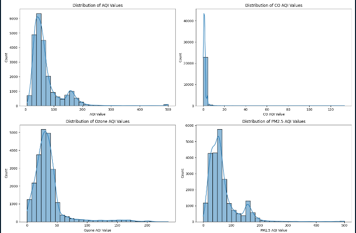
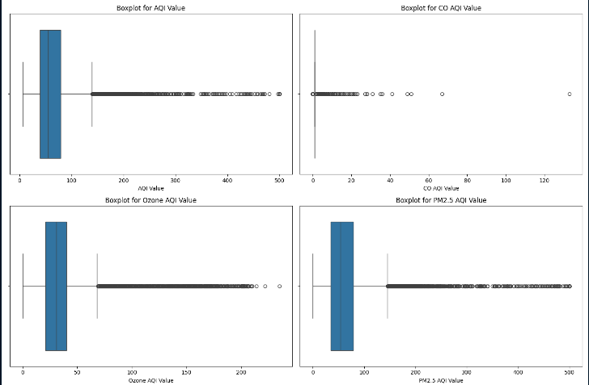
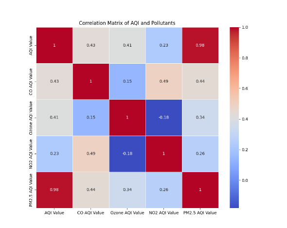
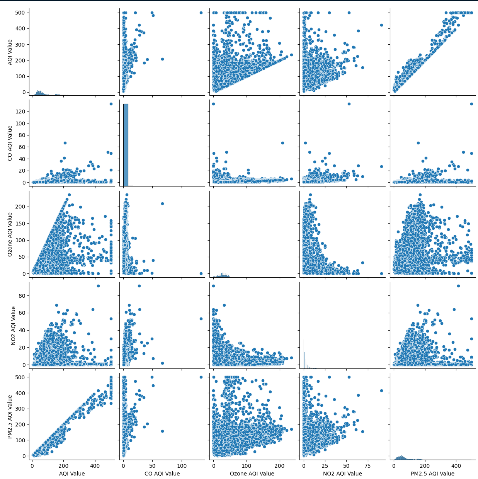
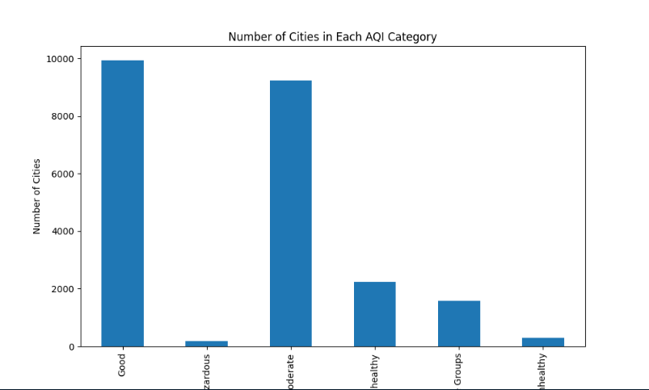
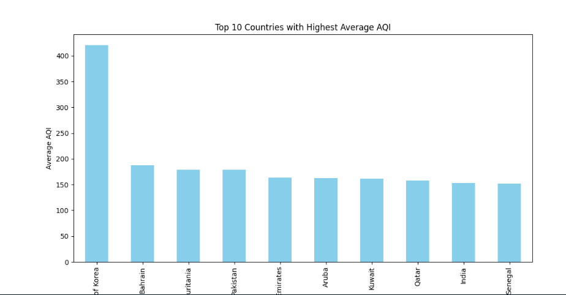
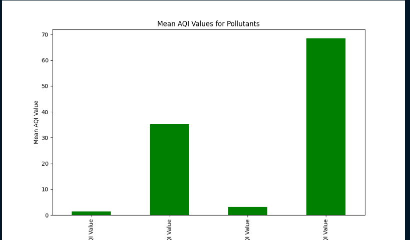
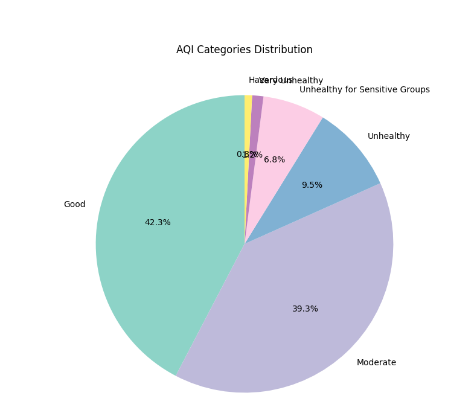

# Air Quality Index (AQI) Exploratory Data Analysis

## Table of Contents
1. [Introduction](#introduction)
2. [Dataset Overview](#dataset-overview)
3. [Exploratory Data Analysis](#exploratory-data-analysis)
    - Data Quality Checks
    - Descriptive Statistics
    - Distribution Analysis
    - Outlier Detection
    - Correlation Analysis
    - Group-wise Analysis
    - Pollutant Contributions
4. [Conclusions](#conclusions)
5. [Visualizations](#visualizations)

---

## Introduction
Air pollution has a significant impact on public health and the environment. The **Air Quality Index (AQI)** is an essential metric used to represent the concentration of pollutants in the air. A higher AQI value represents more hazardous air quality. This project aims to conduct an exploratory data analysis (EDA) on global AQI data to understand the distribution of pollutants and identify trends and patterns in air quality across various cities and countries.

## Dataset Overview
The dataset contains the following columns:
- **Country**: Name of the country.
- **City**: City where the air quality was measured.
- **AQI Value**: The overall AQI index value.
- **CO AQI Value**: AQI value for Carbon Monoxide (CO).
- **Ozone AQI Value**: AQI value for Ozone (O3).
- **NO2 AQI Value**: AQI value for Nitrogen Dioxide (NO2).
- **PM2.5 AQI Value**: AQI value for Particulate Matter (PM2.5).
- **AQI Category**: Category based on AQI value (Good, Moderate, Unhealthy, etc.).

## Exploratory Data Analysis

### Data Quality Checks
The initial data quality checks involved:
- Checking for missing values and duplicates.
- Summary of the dataset, including key statistics.

### Descriptive Statistics
The AQI and pollutant data were summarized using statistical measures such as mean, median, minimum, maximum, and standard deviation. This helps understand the central tendencies and variability of air quality across the dataset.

### Distribution Analysis
- **AQI Value Distribution**: The histogram shows that most AQI values lie between 0 and 100, indicating moderate air quality in most regions.
- **CO AQI Value Distribution**: The concentration of CO in most locations is very low.
- **Ozone AQI Value Distribution**: Ozone levels are generally low, with most values falling below 50.
- **PM2.5 AQI Value Distribution**: PM2.5 concentrations have a wider range, indicating some regions with dangerously high levels of particulate matter.

### Outlier Detection
Boxplots were used to identify outliers in the AQI and pollutant values:
- Significant outliers were detected, especially in the CO and PM2.5 AQI values.
- These outliers represent locations with extreme pollution levels.

### Correlation Analysis
A correlation matrix was generated to analyze relationships between pollutants:
- **PM2.5** has the highest positive correlation with the overall AQI.
- **CO AQI** also shows a moderate correlation with the overall AQI.
- **Ozone AQI** has a weaker correlation with AQI compared to other pollutants.

### Group-wise Analysis
- The number of cities in each AQI category was analyzed. Most cities fall under the "Good" or "Moderate" AQI categories, with a small percentage of cities experiencing "Hazardous" air quality.
- The top 10 countries with the highest average AQI were visualized. South Korea shows the highest average AQI, followed by Bahrain and Mauritania.

### Pollutant Contributions
The mean AQI values for each pollutant were visualized:
- PM2.5 contributes the most to overall AQI, followed by Ozone and CO.

## Random Forests in AQI Prediction

**Random Forests** is a powerful ensemble learning technique that constructs multiple decision trees during training and averages their predictions to improve accuracy and reduce overfitting. It works by generating several subsets of the training data, building individual trees on these subsets, and combining their outputs. For regression tasks, like AQI prediction, Random Forests average the predictions from each tree to produce the final output, effectively minimizing errors and enhancing generalizability.

### Why Random Forests for AQI Prediction?

For AQI prediction, Random Forests is an ideal choice because:
1. **Non-linearity Handling**: AQI data often has complex relationships among pollutants, which may not be linear. Random Forests can capture non-linear interactions between pollutants.
2. **Feature Importance**: Random Forests provide insights into feature importance, helping identify the most influential pollutants, which can guide further research and policy-making.
3. **Robustness to Outliers**: Since each tree in the forest is built on a subset of data, outliers have less influence on the final prediction, making the model more stable.
4. **Interpretability**: While Random Forests are an ensemble model, feature importance scores can help understand which pollutants most significantly impact AQI, thus providing actionable insights.

### Model Results and Interpretation

In this analysis, a **Random Forest Regressor** was trained to predict AQI values based on pollutant data. The model was evaluated on a separate test set, and the following metrics were obtained:
- **Mean Absolute Error (MAE)**: 0.187
- **Mean Squared Error (MSE)**: 5.541
- **Root Mean Squared Error (RMSE)**: 2.354
- **R-squared (R²)**: 0.998

These results indicate that the model performs exceptionally well:
- **High R² (0.998)**: The R² score close to 1 suggests that the model explains nearly all the variability in AQI values, reflecting its high accuracy.
- **Low Error Metrics (MAE and RMSE)**: Both MAE and RMSE are low, indicating that the model’s predictions are very close to the actual AQI values on average.

## Conclusions

- **Exploratory Analysis**:
  - **PM2.5** is the primary contributor to poor air quality.
  - There are significant outliers in pollutant levels in certain regions.
  - Most cities maintain "Good" to "Moderate" air quality, but attention is needed for areas with "Unhealthy" levels.

- **Predictive Modeling**:
  - The **Random Forest Regressor** effectively predicts AQI values based on pollutant levels.
  - The model’s high accuracy suggests that it’s suitable for forecasting and monitoring air quality.

- **Feature Importance**:
  - Emphasizes the critical role of **PM2.5** in air quality.
  - Highlights the need for policies targeting reduction in PM₂.₅ emissions.

## Visualizations
Below are the key visualizations generated during the analysis:

### Distribution Plots
[AQI Distribution]
[Boxplot for AQI and Pollutants]

### Correlation Analysis
[Correlation Matrix]
[Pairplot for AQI and Pollutants]
### Group-wise and Pollutant Contribution Analysis
[AQI Categories by City]
[Top 10 Countries with Highest AQI]
[Mean Pollutant AQI Values]
[AQI Categories Distribution]
---

